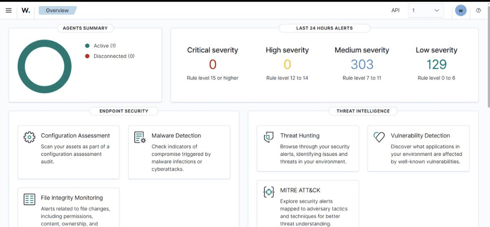
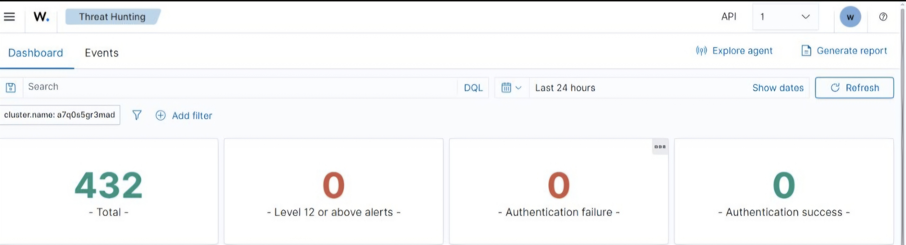
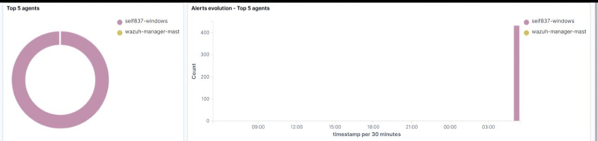

# # Home SOC Lab using Wazuh

## Overview
Built a home SOC lab using Wazuh to centralize log collection, monitoring, and threat detection for a Windows endpoint.

## What I did
- Installed Wazuh manager and enrolled a Windows machine as an agent
- Configured Wazuh's built-in modules: File Integrity Monitoring, Malware Detection, Vulnerability Detection, and MITRE ATT&CK mapping
- Monitored real-time alerts generated from the Windows endpoint over a 24+ hour period
- Used the Threat Hunting dashboard to review and investigate authentication events and other security alerts

## Screenshots

**Overview dashboard — active agent and alert severity breakdown:**

**Threat Hunting dashboard — total events, authentication success/failure breakdown:**

**Top 5 agents and alert activity over time:**

## What this demonstrates
- End-to-end SIEM setup: agent enrollment, log ingestion, and alert generation
- Ability to navigate and interpret Wazuh's dashboards to identify security-relevant activity
- Understanding of core SOC monitoring concepts (severity levels, endpoint security modules, threat intelligence correlation)
